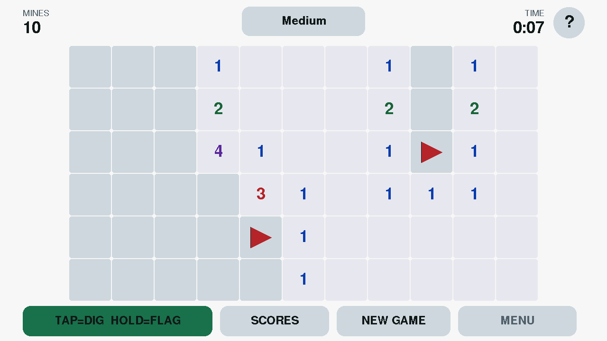
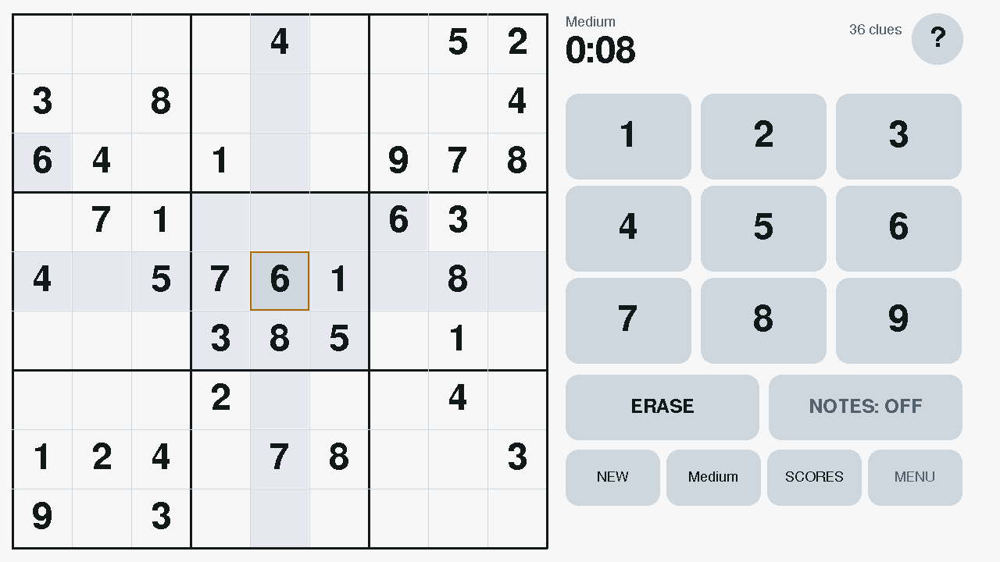
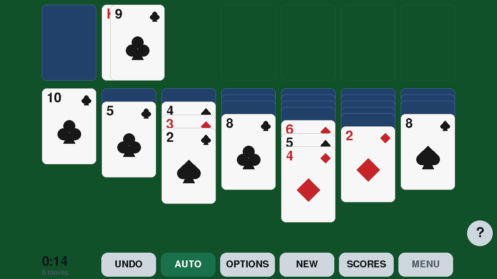

# Tabulous5

A party, puzzle and NES console for the
[M5Stack Tab5](https://docs.m5stack.com/en/core/Tab5) (ESP32-P4), built around
its 1280x720 touch panel.


| | |
|---|---|
| **PhraseCraze** | Describe the phrase without saying it, tap to pass. A hidden timer beeps faster and faster until it buzzes — whoever is holding it loses the point. First team to 7 wins. |
| **FiveHead** | Hold it on your forehead; tilt down to score, up to pass. |
| **Minesweeper** | Tap to dig, hold to flag. Four board sizes. |
| **Sudoku** | Four difficulties, pencil marks, conflict highlighting. |
| **Solitaire** | Klondike, draw one or three, with undo and an auto-play button. |
| **NES** | Cartridges from a microSD card, with sound, on the touch screen or a USB gamepad. |

Word lists are plain text files you edit from a browser over Wi-Fi. Sounds are
generated by a script in this repo. All the graphics are drawn with primitives —
there is nothing to install and nothing on the filesystem that can go missing.

<p align="center">
  
  
  
</p>

> PhraseCraze is written from scratch. "Catch Phrase" is a Hasbro trademark and
> their word lists and artwork are their copyright; game *mechanics* are not, so
> this is a clean-room clone with its own name, its own phrase lists, and its
> own graphics.

## Status

**Phases 0-4 done and verified on hardware.** Five games ship: PhraseCraze,
FiveHead, Minesweeper, Sudoku and Solitaire, under a scrolling launcher with
per-game About screens, high scores, a light/dark theme toggle and battery
monitoring. Content is editable from a browser over Wi-Fi. Sound is sampled
with a synthesised fallback (see [assets/CREDITS.md](assets/CREDITS.md)).
The hardware-independent logic passes 97 host unit tests.

Phase 5 is done too: five procedural game glyphs, gradient-and-shelf blobs,
a buzzer slam, confetti on the PhraseCraze win screen, and the phrase ladder
running on Anton converted to four real pixel sizes by `tools/fontconvert.c`.
A console SETTINGS screen holds the theme, volume, the Wi-Fi editor, and which
games appear in the launcher and in what order.

The NES runs the [Anemoia](third_party/anemoia/) core at a full 60 frames a
second with the P4's PPA doing the scaling, reads its cartridges from a
microSD card, and takes a USB gamepad. Remaining: a coredump partition.
`src/spike/main.cpp` is kept as a bring-up smoke test; `src/hello/main.cpp` is
a bare `Serial.printf` loop for proving the serial link, and `src/bench/`
measures display throughput.

## Build

PlatformIO lives in a project-local venv because Homebrew's Python is
externally managed:

```bash
cd ~/Developer/tabulous5
python3 -m venv .venv && .venv/bin/pip install platformio
```

Then:

```bash
.venv/bin/pio run -e spike            # compile the Phase 0 smoke test
.venv/bin/pio run -e spike -t upload  # flash it over USB-C
.venv/bin/pio run -e spike -t uploadfs  # push data/ to LittleFS
.venv/bin/pio device monitor          # serial logs at 115200
.venv/bin/pio test -e native          # host unit tests (31 cases)
```

### Environments

| env | what it is |
|---|---|
| `spike` | Phase 0 hardware smoke test. The default; flash this first. |
| `native` | Host build of the pure logic, for `pio test`. No hardware needed. |

The game's own device environment gets added once the UI exists; the rules and
content code it will use are already in `src/` and covered by `test/test_game`.

WiFi credentials go in `include/secrets.h` (gitignored — copy
`include/secrets.h.example`).

### Toolchain notes

The Tab5's ESP32-P4 is **not** supported by upstream PlatformIO's `espressif32`
platform. This project pins the [pioarduino](https://github.com/pioarduino/platform-espressif32)
fork, which ships both P4 support and an `m5stack-tab5-p4` board definition.

That board definition matters more than it looks:

- Its Arduino variant defines `BOARD_SDIO_ESP_HOSTED_*` (CLK 12, CMD 13, D0 11,
  D1 10, D2 9, D3 8, RST 15), so WiFi over the C6 configures itself — no
  `WiFi.setPins()` call needed. Those pins match the `esp32_hosted` block in the
  existing ESPHome Tab5 config.
- Its init script installs M5Unified (and M5GFX with it) from git, which is why
  neither appears in `lib_deps` — listing them would pull a second, conflicting
  copy.
- It sets `chip_variant: esp32p4_es`, i.e. pre-rev-3.00 silicon. If your Tab5
  has newer P4 silicon and the build misbehaves, that's the first thing to look
  at.

CPU runs at 360 MHz; 400 MHz is still flagged experimental on the P4.

### Flash layout

`partitions.csv` — no OTA, so one 6 MB app slot and ~10.4 MB of LittleFS for
word packs, sound effects and icons. Word packs are tiny (~15 bytes a phrase, so
10 MB is room for roughly half a million), which is why an SD card is optional
rather than required.

The data partition **must** be named `spiffs` — that's the label Arduino's
`LittleFS.begin()` looks for by default, regardless of the filesystem actually
on it.

## Word packs

One plain-text file per category in `data/packs/`. Edit them in any text editor;
`pio run -t uploadfs` pushes them to the device.

```
# name: Movies & TV
# color: #E4572E
# icon: film
Jurassic Park
The Great British Bake Off | easy
Eternal Sunshine of the Spotless Mind | hard
```

`#` lines are `key: value` headers (`name`, `color`, `icon` are required). Blank
lines are ignored. The `| difficulty` suffix is optional and defaults to
`medium`; it drives the kids-mode filter.

Validate before flashing:

```bash
python3 tools/packs.py
```

It reports per-pack counts and difficulty spread, and fails on duplicates,
malformed difficulties, missing headers and bad colors. It also warns about
phrases long enough to render awkwardly small on the round screen. Phrases
appearing in more than one pack are reported but allowed — "Popcorn" legitimately
belongs in both Food and Movies.

Ships with 8 packs / ~920 phrases.

## Seeing the screen

The panel is write-only in practice — `readRect` and `readRectRGB` both return a
constant on this DSI panel whatever is displayed. So capture works the other
way round: `uikit::setSurface()` points every screen's drawing at an off-screen
canvas in PSRAM, which is readable, and the firmware streams that over serial.

```bash
tools/shot                          # ~/Desktop/tab5-<timestamp>.png, opened
tools/shot menu.png                 # to a file you name
tools/shot --wait=15                # 15s countdown, then capture
tools/shot --tap=640,682 set.png    # tap first, then capture
tools/shot --font font.png          # every phrase-ladder step
tools/shot --no-open out.png        # write it, don't open it
```

**`--wait=N` is how you photograph a screen you reach by hand.** Opening the
serial port reboots the board, so the countdown deliberately starts *after* the
reboot — the whole window is usable, and a countdown that ran before it would
only be counting down to a reset that throws the screen away. Navigate during
the countdown and the shot catches wherever you land.

`tools/shot` finds a Python with pyserial by itself (PlatformIO's venv always
has one, so there is nothing to install) and can be symlinked onto `PATH` — it
locates the project from its own path. `tools/screenshot.py` underneath it
takes the same flags plus `--raw`, which also writes the undecoded RGB565 for
`tools/raw2png.py` to re-decode locally if colours ever look wrong.

`--tap=X,Y` goes through `app::handleTap`, the same entry point a real touch
uses, so it exercises the real hit targets. Taps chain, so a screen several
steps in is reachable: `tools/shot --tap=640,682 --tap=845,559 out.png`. Note that opening the port resets the board; the tool
waits for boot before driving anything, because a tap that lands before the
first repaint finds no hit targets registered.

Two things will bite anyone extending this: LovyanGFX sprite buffers hold
RGB565 **big-endian**, and `Serial.setTxTimeoutMs(0)` drops bulk output, so the
dump raises the timeout for the transfer and restores it after.

## Sound

Effects live in `data/sfx/*.wav` (22.05 kHz, 16-bit mono) and are generated,
not sampled — `tools/make_sfx.py` synthesises all seven from sine partials,
seeded noise and envelopes, so they carry no attribution requirement. Regenerate
and reflash with:

```bash
tools/make_sfx.py                       # rewrites data/sfx/
.venv/bin/pio run -e tab5 -t uploadfs   # puts them on the device
```

`audio::loadSamples()` reads them at boot and falls back to a synthesised tone
for anything missing or malformed, so the device plays fine on a virgin
filesystem — the boot line reports `sfx=N/7`. Replacing a sound needs no
firmware change, just a file with the same name. Details and the WAV formats
accepted are in [assets/CREDITS.md](assets/CREDITS.md).

The accelerating round beep stays synthesised on purpose: its timing is the
game's tension and it must land exactly where the round timer says.

## NES

Menu → **NES**. Put `.nes` files in a `/roms` folder on a FAT32 microSD card
(subfolders one level deep are fine), or in `data/nes/` and `pio run -t
uploadfs` for a few built-in ones. The card is read once per boot: a full
No-Intro set of 5,800-odd titles takes about two seconds to index. The list
is a rail of groups down the left — Favourites, `#`, A to Z — and pages of
fourteen titles; the star on a row keeps a game in Favourites, stored in
`/nes_favs.txt` on the built-in filesystem so it survives a card swap.

The header button chooses the picture size. **2x TOUCH** draws the game at
512x480 with a D-pad, A, B, Select and Start on the screen either side of it.
**3x GAMEPAD** fills the full height (768x720) and expects a USB gamepad on
the USB-A port; hold Select+Start to leave a game, or tap MENU in the margin.
That size names the pad it found under MENU, or says there isn't one: a game
plays its attract loop whether or not anything is listening, so without that
line an unplugged pad looks exactly like a console that has locked up.
Any generic HID pad should work — the console reads the pad's own report
descriptor rather than matching vendor IDs. The GP100's SNES layout is mapped
out of the box (X and Y double as A and B); **Gamepad Test → MAP PAD** teaches
any other pad in four presses.

Why it is fast: the core emits RGB565 scanlines into internal RAM and the
P4's Pixel Processing Accelerator scales and rotates them straight into the
panel's framebuffer while the next frame is being emulated. The CPU version of
that blit cost 9.6 ms a frame and forced drawing every other one. ROMs are
copied into PSRAM at load, so bank switches never touch the card.

Mappers 0, 1, 2, 3, 4 and 69 are supported, which covers most of the library;
anything else is listed with the reason it will not run. The card stays in
whatever layout you give it — one open in a folder of thousands of files costs
~110 ms on the 4-bit bus, which is fine for a pick and would not be for a
scan, so the scan uses `readdir` and reads no file headers until you pick.

## Arcade

Menu → **Arcade**. One board is emulated, the 1980 Namco Pac-Man board, and a
great many games shipped on it — so the library is not two games but seventy:
Pac-Man and Puck Man, the Ms. Pac-Man bootlegs that ran on an unmodified board,
Crush Roller, Ponpoko, Eyes, Piranha, Mr. TNT, Naughty Mouse, Lizard Wizard,
Jump Shot, Pac-Man Plus and a long tail of bootleg reskins. No daughterboard is
emulated; every set here is one the plain board ran.

Which sets those are is not a list anyone typed. `tools/mamescan.py` reads
MAME's own Pac-Man driver and keeps the sets whose hardware is the plain board:
the right ROMs in the right places, no protection chip, and an init routine
that only rearranges ROM data. Its output is checked in as
`tools/arcade_games.json`, so building a game needs the romset and nothing else.

An arcade board's ROMs are several separate chips, and the game list is one row
per file, so the chips are packed on the machine that has the romset:

```bash
tools/mkarcade.py --all ~/path/to/MAME*/ /Volumes/CARD/arcade
```

That writes a `.arc` file per game, skipping any whose romset is not there;
`--set NAME` builds one, `--list` shows what it knows. Put the files in
`/arcade` on the card, or in `data/arcade` and flash them with
`pio run -t uploadfs` — they are 25 to 42 KB each. **No ROMs come with this
project.**

A chip is found in the zip by its checksum, not its name: merged romsets store
each distinct file once, under whichever game named it first, so a clone's
folder holds only the files that differ and the rest sit elsewhere under other
names.

Some of these games need their ROMs rearranged before the board can run them —
the data lines are crossed on the Eyes boards, Pac-Man Plus and Jump Shot are
lightly encrypted, Ponpoko stores its tiles the other way round. All of that is
a fixed transformation of the bytes, so the packer does it and the firmware
stays ignorant of it. Two things the firmware does carry, because they are
board wiring rather than data: the 48K memory map, where a second set of
program ROMs answers at 0x8000 (Ms. Pac-Man and Ponpoko need it), and the PAL
that rewrites a couple of interrupt vectors on the Piranha and Naughty Mouse
boards. Both are declared in the `.arc` header.

Ms. Pac-Man is the one game here that was not a board. It was sold as a kit
that plugged into a Pac-Man board between the CPU and its ROMs, carrying the
new game as an encrypted copy of the whole program and swapping itself in and
out by watching the address bus: touch any of eight small windows in the code
and the program changes under the CPU's feet. That is how it ran on a board
that had never heard of it, and why the bootlegs exist — they are the kit
flattened into plain ROMs.

Both copies of the program are built by the packer, since the decryption and
the forty patches are fixed; the firmware only does the swapping, which is a
bank pointer and a table of pages to watch. It costs one indexed byte load per
memory access, and only on the six sets that were sold as the kit: the real
Ms. Pac-Man, the speedup hack, Ms. Pac Attack, Heart Burn, Pac-Gal and the
Crush Roller conversion.

The speedup hack really is faster, and by a measurable amount: driven left from
the same spot with the same input, she covers the same hundred units of the
maze in 1.5 seconds where the standard game takes 2.5.

Seventy rows of mostly-bootlegs is a wall of near-identical names, so the
distinct games — one per title, best set of each — are starred the first time
the list is opened. Unstarring one sticks; the shortlist is never applied twice.

These cabinets had a four-way stick: a plate under the handle that makes two
directions at once physically impossible. The program was written on top of
that and does nothing sensible when it is broken, and every control we have
breaks it -- a cross, a thumbstick and four buttons on a screen all let two
adjacent directions be held together. Hold left and add up and the board keeps
going left until it hits a wall, so turning a corner means letting go of the
old direction before pressing the new one, exactly, every time.

So the plate is put back in software, on the sixty-six of these games MAME
records as four-way. Two directions become one, favouring whichever just
changed: holding left and adding up is a turn upward, on that frame. The rule
is MAME's own, which is why no ROM needed patching to get it. Jump Shot and
Lizard Wizard really were eight-way and are left alone; which is which travels
in the `.arc` header with everything else about the cabinet.

The cabinet's monitor stands on its side, so the picture does too: it is turned
upright while the palette is applied, which costs nothing extra. Ponpoko and
its bootlegs are the exception — the same board, the monitor the usual way
round — and turning those would be the bug, so MAME's orientation for each game
travels in the `.arc` header and a horizontal picture is left alone. **FULL**
is 2.5x, exactly the panel's height. SELECT puts a coin in, START begins a
game, and the round button is the cabinet's second start button.

That second button is there because several of these games read it during
play. Ms. Pac-Man Plus keeps its speed-up on it, and its invincibility on the
first start button; neither is a DIP switch on any of these boards, which is
the only speed-up any of the Ms. Pac-Man sets here has. Verified by running
the same scripted game twice, with the button held and not, and diffing the
frame: it changes play in Ms. Pac-Man Plus and nowhere else.

Note that the board runs a power-on self test for about nine seconds before it
starts reading its inputs, so a coin dropped in the first few seconds is
ignored -- by the real board too.

It runs at **60 frames a second**, which took replacing the CPU. chips' own Z80
is stepped one clock at a time — exact, and about 30 ms of work for each 16.7
ms of machine time, so the game ran at half speed. Neither internal RAM nor
running the code from IRAM moved it, because the cost is the work itself:
manipulating a 64-bit pin mask three million times a second on a 32-bit CPU.

`namco_fast.c` runs the same board — the same video decode, sound chip and bus
map — but executes whole instructions with
[superzazu's Z80](https://github.com/superzazu/z80) and then advances the
hardware by however many cycles each one took. Emulation went from 30 ms a
frame to 12.4.

## Files (Wi-Fi)

The address on the Wi-Fi screen opens the file manager, for the card and the
built-in filesystem; the word-pack editor is a link away at `/packs`.

Upload is drag-and-drop, one request per file, written to a temporary name and
renamed into place so a dropped connection leaves no half-written ROM. Each row
has **Rename**; everything else works on a selection, with **Select all**
taking whichever rows the current view is showing:

- **Hide** / **Unhide** keep titles on the card but out of the NES list.
  Recorded as one name per line in a `.hidden` file in the same folder, so the
  list travels with the card and can be edited by hand.
- **Favourite** / **Unfavourite** write the same `/nes_favs.txt` the star in
  the NES browser does, so the two agree.
- **Delete** asks first, and is the only destructive one.

**Show: All / Hidden / Favourites** filters the folder, which is how you find
something to unhide or unfavourite. Renaming carries both flags across. The
NES list re-scans after any change.

## Content editor (Wi-Fi)

Menu → **EDIT CONTENT OVER WI-FI**. Two ways in, because neither always works:

- **Auto** (default) tries the network in `include/secrets.h`, and falls back
  to the device's own hotspot if it can't join within 25 s.
- **Hotspot** publishes an open network named `Tabulous5` with a wildcard DNS
  server, so phones show the captive-portal prompt and the editor opens by
  itself. It is open on purpose: a password behind a captive portal is a lot of
  friction at a party, the hotspot only exists while the editor screen is open,
  and it serves word lists rather than secrets.

A button on the editor screen switches between the two without a reflash.
Games reload their packs on FINISH, but only if something was actually written.

Opening the editor hands back the SNES core's 128 KB internal-memory
reservation first, and takes it again on FINISH. The Wi-Fi co-processor talks
over SDIO and its driver wants DMA buffers in internal memory; with the
reservation held there was not enough left, and bringing the radio up aborted
inside the FreeRTOS tick hook — the console rebooted the moment the editor was
opened. The SNES falls back to PSRAM until the next reboot, which is the same
trade the other emulators make.

### It is not a word-pack editor

It edits text files inside directories registered as editable roots. A future
game gets an editor with no changes to the server or the page it serves:

```cpp
contentserver::addRoot("/trivia", "Trivia questions", ".txt");
```

The browser asks the device for the root list, so the UI adapts too. Everything
game-specific lives in the file format.

### Two things that matter, because this writes to the games' filesystem

- **Paths are validated.** A path is accepted only if it sits *directly* inside
  a registered root, with no `..` and no subdirectories. Everything the browser
  sends is untrusted.
- **Saves are atomic** — written to `.tmp` then renamed — so a dropped
  connection can't leave a half-written pack that fails to parse.

**`WebServer` only exposes a raw body as `arg("plain")` when it did not parse
the request as a form.** A form-encoded POST therefore arrives with no visible
body, and writing that truncated the file to zero *while reporting success* —
silently emptying a pack. Writes without a body-bearing content type are now
refused with a 415. Don't "simplify" that check away.

## When it crashes

The firmware writes an ELF core file into a 64 KB `coredump` partition when it
panics, and it survives the reboot — so a crash that happens while nobody is
watching the serial port can still be read afterwards:

```bash
tools/coredump
```

That prints the function and line the crash happened in, and where every other
thread was. Nothing extra needs installing: the core file is a normal ELF and
the addresses are resolved with `addr2line` from the toolchain that built the
firmware. To check the path still works, send `C` on the serial port and the
firmware will crash on purpose.

## Troubleshooting

**The device boot-loops with `assert failed: lfs_fs_grow_`.** The LittleFS
partition got smaller than the filesystem already written to it — which is what
happens if you change a size in `partitions.csv` above the `spiffs` line, or
shrink `spiffs` itself. LittleFS mounts, finds it has been formatted for more
blocks than the partition now holds, and asserts. Fix it with
`pio run -t uploadfs`, which rewrites the filesystem at the new size; the crash
loop makes the USB port come and go, so the upload may need a couple of
attempts. Everything in `data/` comes back; anything edited on the device does
not.

**No sound anywhere after a crash.** A reset that lands mid-transaction on
the internal I2C bus can leave the ES8388 codec or the I/O expander that
enables the amplifier wedged, and nothing short of a real power cycle clears
it — flashing only resets the P4. Hold the power button until it shuts down,
unplug USB-C, wait ten seconds. Lost an hour bisecting code for this.

**The console freezes while a browser lists a big folder.** The Arduino File
API opens every entry it lists, and one open in a FAT directory of thousands
of files is a linear search through the whole directory. Anything that walks
the card must use `readdir` (see `filemanager.cpp` and the NES scan).

**The console freezes and nothing responds.** Not a crash: a crash reboots and
leaves a core dump. A freeze is the main loop blocked, and because that loop is
what reads the touch screen and the gamepad, both go dead together while the
last frame stays on the panel. Leaving a game is the likeliest moment, because
that path stops the speaker and closes a file on the card, and a wedged I2C bus
turns the codec call into a wait that never ends.

**If sound had already stopped working, that is the same fault one step
earlier** — the codec is wedged, and only a power cycle clears it. Reflashing
does not.

The main loop is now watched, and fifteen seconds without a pass is a panic
rather than a freeze, so `tools/coredump` names the call that blocked. Serial
`H` hangs on purpose to prove that still works; `C` crashes on purpose to prove
the dump does.

**WiFi won't associate.** Overwhelmingly the likeliest cause is stale
`esp_hosted` slave firmware on the ESP32-C6, not a bad password. The
`m5stack-tab5-basics-panel` ESPHome project has a known-good
`firmware/network_adapter_esp32c6.bin`. That project also found 40 MHz SDIO
unstable on this unit where 20 MHz was fine.

**Blank screen with the backlight on.** M5Stack shipped the Tab5 with three
different display driver ICs (ILI9881C, ST7123, ST7121). M5GFX autodetects, but
if it picks wrong you get exactly this symptom.

**Touch feels dead or laggy — check this first.** On the ESP32-P4, `Serial` is
the native USB-serial-JTAG. If nothing is attached reading it, its TX buffer
fills and **every `Serial.print` then blocks until it times out, about two
seconds**. That stalls `loop()`, so touches are never read, and it presents as
an intermittent dead touchscreen with no visible cause.

The trap is that attaching a serial monitor drains the buffer and the symptom
disappears — so it hides from precisely the tool you would use to find it, and
any "fix" tested while a monitor is attached looks like it worked.

`Serial.setTxTimeoutMs(0)` in `setup()` is the guard: write if a host is
listening, otherwise drop it. **Never remove that line**, and be wary of adding
`Serial.print` to any per-frame or per-tap path.

**Serial reads back nothing at all, but flashing works.** Different fault, same
symptom. On the P4's USB-serial-JTAG, RTS is wired to chip reset and DTR to the
boot pin, and pyserial asserts *both* when it opens a port — so an ordinary
`serial.Serial(port, 115200)` silently holds the board in reset, and setting the
lines False afterwards is too late (it has already latched
`boot:0x204 (DOWNLOAD)`). They must be False **before** `open()`. Use
`tools/serial_read.py`, which does that and can also issue a proper hard reset:

```bash
~/.platformio/penv/bin/python tools/serial_read.py 20 --reset
```

**Touch feels dead / taps are ignored.** Almost certainly nothing to do with
the touch controller. The UI redraws synchronously in `loop()`, so a slow
repaint blocks `M5.update()` and any tap that starts and ends inside that
window is never seen. A full-screen 1280x720x16bpp `M5Canvas` in PSRAM cost
**~750 ms per `pushSprite`**; drawing straight at the panel is **~45 ms**. The
ESP32-P4's MIPI-DSI panel already scans out of its own framebuffer, so an
off-screen buffer buys nothing and costs everything — `kUseCanvas` in
`ui.cpp` stays `false`. There's a guard that logs any repaint over 100 ms.

Diagnosing this the slow way is avoidable: probe `M5.In_I2C.scanID(0x55)` (the
ST7123 touch controller). If it still acknowledges, the panel is fine and the
problem is above the bus.

**Touch offset or mirrored.** The spike's touch test draws a dot where you tap
with corner labels to check against. `M5.Display.setRotation(1)` is doing the
landscape transform; the ESPHome config needed `swap_xy` + `mirror_x` on top of
its own orientation, so don't assume rotation alone is right.

## Licence

**GPL-3.0-or-later** — see [LICENSE](LICENSE), and [COPYING.md](COPYING.md) for
what that means in practice and which components carry their own terms.

This was MIT until 2026-09-07. It was relicensed to use the Anemoia-ESP32 NES
core, which is GPL-3.0. Copies taken under MIT keep their MIT rights; everything
from that commit onward is GPL-3.0.
